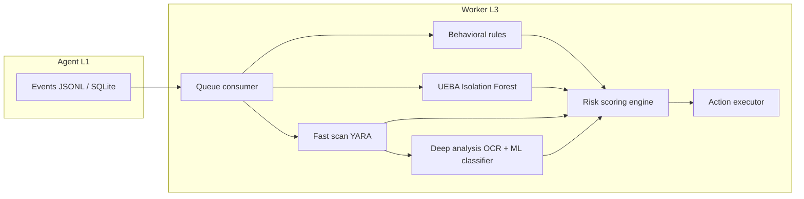
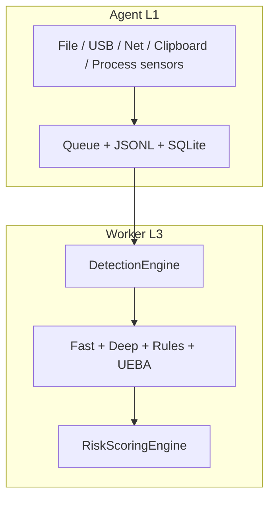

# Phương pháp tính Risk Score, tích hợp ML và ngưỡng phân loại

Tài liệu bổ sung cho **Chương phương pháp** (định dạng kỹ thuật, có công thức và tham số), phù hợp góp ý hội đồng về: (1) **công thức hợp nhất** các thành phần điểm (2) **vai trò điểm đặc bị Isolation Forest** (3) **ngưỡng Low / Medium / High / Critical** (4) **cấu hình** (5) **thuật toán phát hiện/giám sát** ở mức pipeline.

**Mã tham chiếu:** `worker/config.py`, `worker/core/risk_scoring.py`, `worker/worker.py`, `ML/behavioral_ml_analyzer.py`.

---

## 1. Tổng quan pipeline phát hiện (L3 Worker)

Luồng dữ liệu từ event agent → quyết định hành động:

**Thuật toán / thành phần chính:**

| Bước | Mô tả ngắn | File tham chiếu |
|------|------------|-----------------|
| Đọc event | Lấy payload từ SQLite `events.db` | `worker/core/queue_consumer.py` |
| Fast scan | YARA: PII, API key, archive mật khẩu, … | `worker/config.py` (`YARA_RULES`), engine scan |
| Deep analysis | OCR (tùy cấu hình), ML phân loại nhạy cảm | `worker/` (module deep analysis) |
| Behavioral rules | Rule theo `event_type`, context, đích đến | `worker/core/behavioral_rules.py` |
| UEBA | Isolation Forest → `anomaly_score` ∈ [0, 100] | `ML/behavioral_ml_analyzer.py` |
| Risk scoring | Một trong ba phương pháp (mục 2) | `worker/core/risk_scoring.py` |
| Hành động | `alert` / `log` (block cấu hình unreachable) | `worker/core/action_executor.py` |

---

## 2. Ba phương pháp gán Risk Score (cấu hình `RISK_SCORING_METHOD`)

### 2.1. Phương pháp **traditional** (trọng số nội dung / hành vi / bối cảnh)

**Điểm thành phần** (mỗi thành phần đều được chuẩn hóa về thang 0–100, sau đó nhân trọng số):

- \(S_c\) = Content score — YARA, IOC, ZIP mật khẩu, ML nhạy cảm, OCR (mẫu số).
- \(S_b^0\) = Behavior score (chuỗi quy tắc đích đến, clipboard, USB, …).
- \(S_{ctx}\) = Context score — tiêu đề cửa sổ, domain, ứng dụng, …

**Tích hợp điểm bất thường Isolation Forest (UEBA)** vào **kênh Behavior** (không vào Content):

\[
S_b = \min\left(100,\; S_b^0 + \beta \cdot S_{anomaly}\right)
\]

- \(S_{anomaly}\): điểm từ `BehavioralMLAnalyzer` (0–100), `behavioral_ml_analyzer.py` chuẩn hóa từ đầu ra Isolation Forest.
- \(\beta =\) `ML_ANOMALY_BEHAVIOR_BLEND` (mặc định **0.25**, chỉnh qua biến môi trường).

**Công thức tổng hợp:**

\[
R_{total} = w_c \cdot S_c + w_b \cdot S_b + w_{ctx} \cdot S_{ctx}
\]

Trọng số mặc định trong `WorkerConfig.RISK_WEIGHTS`:

| Thành phần | Ký hiệu | Trọng số mặc định |
|------------|---------|-------------------|
| Content | \(w_c\) | \(0{,}5\) |
| Behavior | \(w_b\) | \(0{,}3\) |
| Context | \(w_{ctx}\) | \(0{,}2\) |

\[
w_c + w_b + w_{ctx} = 1
\]

**Quyết định hành động (alert / log):** so sánh \(R_{total}\) với `RISK_THRESHOLDS['alert']` (mặc định **40**). `block` được giữ trong config với giá trị rất lớn (chế độ chỉ cảnh báo).

---

### 2.2. Phương pháp **nist_based** (NIST SP 800-30: R = L × I)

**Ý tưởng:** Likelihood \(L \in [1,5]\), Impact \(I \in [1,4]\), chuẩn hóa về 0–100.

\[
R_{raw} = L \cdot I,\qquad
R_{total} = \frac{R_{raw}}{L_{max} \cdot I_{max}} \times 100
\]

- \(L_{max} = 5\), \(I_{max} = 4\) (`NIST_MAX_VALUES`).

**Likelihood** là tổng có trọng số các thành phần đích đến, hành vi người dùng, bảo vệ file, tần suất (`NIST_LIKELIHOOD_WEIGHTS`), **cộng thêm** phần boost từ ML:

- Nếu `ml_is_anomaly` và \(S_{anomaly} \ge\) `ML_ANOMALY_BOOST_THRESHOLD`, cộng **tối đa 2 điểm** vào vế likelihood (trước khi chuẩn hóa), theo đoạn code trong `NISTBasedRiskScoringEngine`.

**Tích hợp Isolation Forest:** điểm **0–100** được đưa vào **khả năng (Likelihood)** qua `ml_likelihood_boost`, không nhân trực tiếp vào Impact.

**Override chính sách:** `force_max_risk` → \(R_{total} = 100\), `action = alert`.

---

### 2.3. Phương pháp **research_based** (đa nhân tố)

\[
R_{total} = w_A A + w_B B + w_C C + w_T T + w_F F
\]

| Thành phần | Ký hiệu | Trọng số mặc định (`RESEARCH_RISK_WEIGHTS`) |
|------------|---------|-------------------------------------------|
| Anomaly | \(A\) | 0,25 |
| Behavioral deviation | \(B\) | 0,25 |
| Content sensitivity | \(C\) | 0,30 |
| Temparol | \(T\) | 0,10 |
| Frequency | \(F\) | 0,10 |

Trong đó \(A\) có thể kết hợp chỉ báo từ ML trong `deep_analysis` (xem `_calculate_anomaly_score` trong `risk_scoring.py`).

---

## 3. Phân loại mức độ rủi ro: Low, Medium, High, Critical

Sau khi có \(R_{total} \in [0,100]\), hàm `classify_risk_level()` ánh xạ theo **ba ngưỡng** (cấu hình được):

| Mức | Điều kiện (mặc định) |
|-----|----------------------|
| **low** | \(R_{total} < 25\) |
| **medium** | \(25 \le R_{total} < 50\) |
| **high** | \(50 \le R_{total} < 75\) |
| **critical** | \(R_{total} \ge 75\) |

**Tham số:** `RISK_LEVEL_LOW_MAX`, `RISK_LEVEL_MEDIUM_MAX`, `RISK_LEVEL_HIGH_MAX` (mặc định 25, 50, 75).

**Lưu ý:** Mức phân loại (`risk_level`) **khác** với hành động `alert`/`log` (dựa trên `RISK_THRESHOLDS['alert']`). Ví dụ có thể `medium` nhưng vẫn `alert` nếu \(R_{total} \ge 40\).

---

## 4. Cấu hình cho quản trị (admin)

**Đề án hiện tại:** điều chỉnh qua **biến môi trường** và **Docker** / file `.env`, không có màn hình web riêng trong repo này chỉ để đổi ngưỡng. Dashboard (`dashboard/`) phục vụ hiển thị — nếu tích hợp sau này, nên gọi API cập nhật cùng các biến sau.

| Biến / tham số | Ý nghĩa | Giá trị mặc định (tham khảo) |
|----------------|---------|------------------------------|
| `RISK_SCORING_METHOD` | `traditional` / `nist_based` / `research_based` | `nist_based` |
| `RISK_THRESHOLDS` (trong code) | Ngưỡng `alert` | `alert`: 40 |
| `ML_ANOMALY_THRESHOLD` | Ngưỡng coi là anomaly (Isolation Forest → điểm 0–100) | 70 |
| `ML_ANOMALY_BOOST_THRESHOLD` | Ngưỡng để bắt đầu boost Likelihood (NIST) | 70 |
| `ML_ANOMALY_BEHAVIOR_BLEND` | Hệ số \(\beta\) gộp anomaly vào Behavior (traditional) | 0,25 |
| `RISK_LEVEL_LOW_MAX`, `RISK_LEVEL_MEDIUM_MAX`, `RISK_LEVEL_HIGH_MAX` | Ranh giới phân loại 4 mức | 25, 50, 75 |
| `SENSITIVE_EXFIL_FOLDERS` | Thư mục cấm thất thoát (override max risk) | (tùy môi trường) |

**Phạm vi cho phép:** điểm ngưỡng nên nằm trong \([0,100]\); trọng số traditional phải có tổng = 1 (nếu chỉnh trong code).

---

## 5. Sơ đồ kiến trúc hệ thống (tổng quan Agent + Worker)

---

## 6. Trích dẫn và chuẩn

- **NIST SP 800-30:** Mô hình rủi ro \(R = f(\text{Likelihood}, \text{Impact})\) — phương pháp `nist_based` chuẩn hóa tích \(L \times I\) về 0–100.
- **Isolation Forest:** Sklearn / pipeline huấn luyện trong `ML/`; điểm đầu ra được chuẩn hóa 0–100 trong `behavioral_ml_analyzer.py`.

---

## 7. Liên kết tài liệu khác

- `docs/GIAI_THICH_AGENT_VA_SU_KIEN.md` — Agent L1 và các `type` event.
- `worker/README.md` — Cấu hình worker tóm tắt.

---

*Tài liệu này được căn cứ trực tiếp vào mã nguồn trong `HybridDLP_ED`; khi chỉnh thuật toán, cần cập nhật đồng thời bảng công thức và bảng tham số ở trên.*
