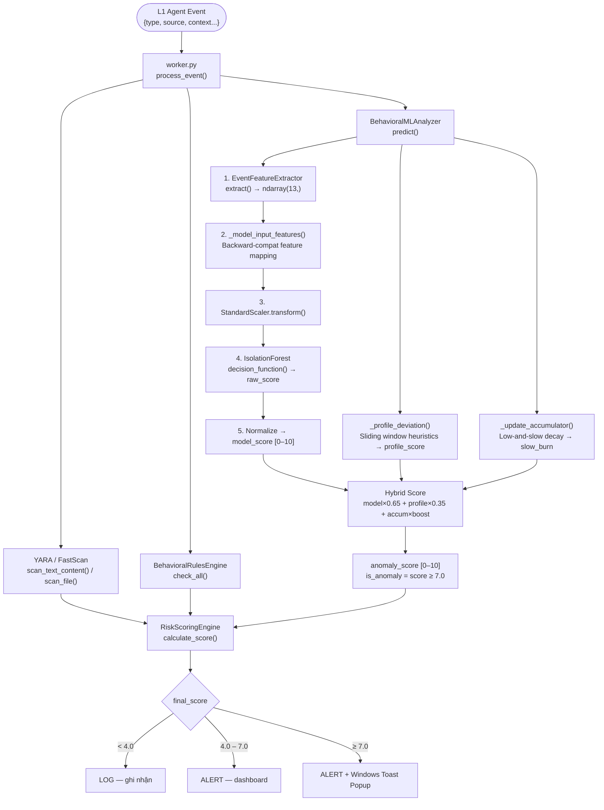
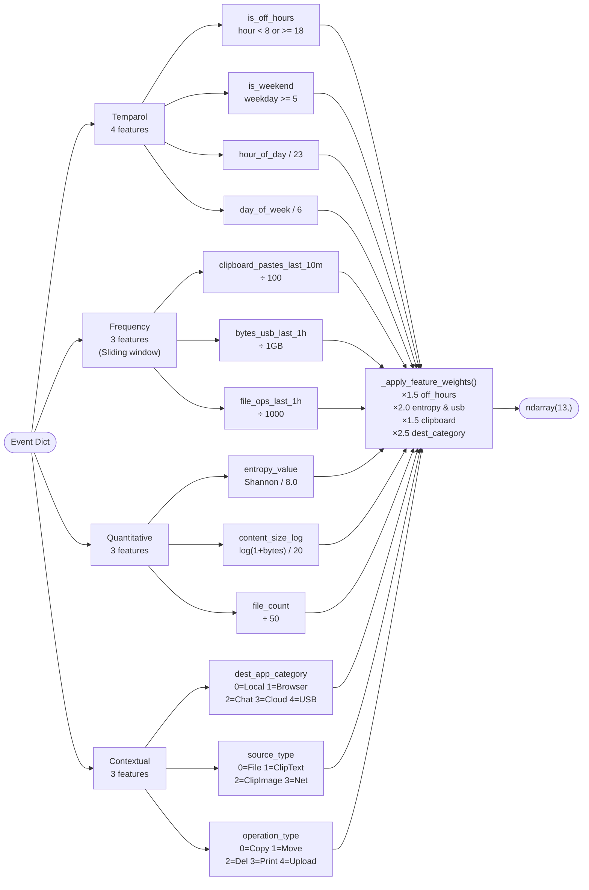
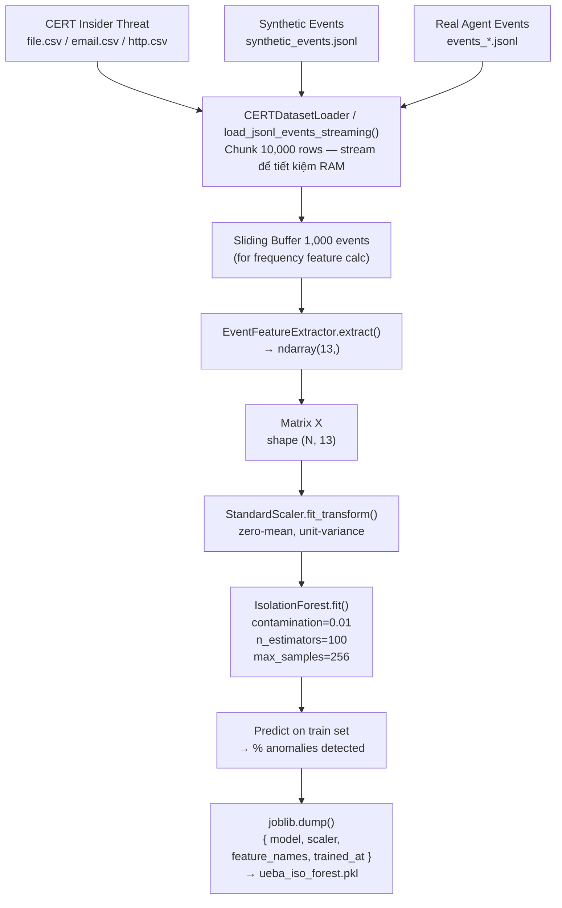

# HybridDLP — Kiến trúc Machine Learning (UEBA)

## 1. Tổng quan

Hệ thống tích hợp một module **UEBA** (User and Entity Behavior Analytics) dựa trên **Unsupervised Machine Learning** để phát hiện hành vi bất thường của người dùng trong thời gian thực. Module này **không thay thế** YARA scan hay rule-based detection — mà hoạt động song song và đóng góp vào điểm rủi ro cuối cùng.

```
L1 Agent Event
      │
      ▼
[Worker: process_event()]
      │
      ├─── YARA / FastScan ──────────────────────────────────────► yara_score
      │
      ├─── BehavioralRulesEngine (rule-based heuristics) ────────► behavioral_score
      │
      ├─── BehavioralMLAnalyzer.predict() ◄── ML MODULE ─────────► ml_anomaly_score
      │         ├── IsolationForest (model_score × 0.65)
      │         ├── ProfileDeviation (profile_score × 0.35)
      │         └── SlowBurnAccumulator (+accum × boost_factor)
      │
      └─── RiskScoringEngine.calculate_score() ──────────────────► final_score → ACTION
```

---

## 2. Flow Xử lý ML (Real-time)

### 2.1 End-to-end — Event → Action



---

### 2.2 Feature Extraction — Chi tiết 13 chiều



---

### 2.3 Training Pipeline



---


### Các file liên quan

| File | Vai trò |
|---|---|
| [ML/behavioral_ml_analyzer.py](file:///c:/PRJ/ProjectIA/DLD_IA01/HybridDLP_ED/ML/behavioral_ml_analyzer.py) | **Core engine**: hybrid scoring, predict(), accumulator |
| [ML/feature_extractor.py](file:///c:/PRJ/ProjectIA/DLD_IA01/HybridDLP_ED/ML/feature_extractor.py) | Biến đổi event → vector 13 chiều |
| [ML/train_ueba.py](file:///c:/PRJ/ProjectIA/DLD_IA01/HybridDLP_ED/ML/train_ueba.py) | Pipeline training (IsolationForest + StandardScaler) |
| [ML/cert_dataset_loader.py](file:///c:/PRJ/ProjectIA/DLD_IA01/HybridDLP_ED/ML/cert_dataset_loader.py) | Load CERT Insider Threat Dataset → agent event format |
| [ML/generate_synthetic_data.py](file:///c:/PRJ/ProjectIA/DLD_IA01/HybridDLP_ED/ML/generate_synthetic_data.py) | Tạo dữ liệu tổng hợp khi thiếu dữ liệu thực |
| [worker/ml_models/ueba_iso_forest.pkl](file:///c:/PRJ/ProjectIA/DLD_IA01/HybridDLP_ED/worker/ml_models/ueba_iso_forest.pkl) | Model đã train (joblib format) |

---

## 3. Feature Extraction — 13 Chiều

`EventFeatureExtractor.extract(event)` → `np.ndarray(13,)`

### Nhóm 1: Temparol (4 features)

| Index | Tên | Mô tả | Normalize |
|---|---|---|---|
| 0 | `is_off_hours` | Ngoài giờ làm (< 8h hoặc ≥ 18h) | 0/1 × weight 1.5 |
| 1 | `is_weekend` | Thứ 7, Chủ nhật | 0/1 |
| 2 | `hour_of_day` | Giờ trong ngày | /23.0 → [0,1] |
| 3 | `day_of_week` | Thứ trong tuần (0=Mon) | /6.0 → [0,1] |

### Nhóm 2: Frequency — Sliding Window (3 features)

| Index | Tên | Window | Normalize |
|---|---|---|---|
| 4 | `clipboard_pastes_last_10m` | Số paste trong 10 phút | /100 × weight 1.5 |
| 5 | `bytes_transferred_usb_last_1h` | Tổng bytes copy ra USB/1h | /1GB × weight 2.0 |
| 6 | `file_operations_last_1h` | Số thao tác file/1h | /1000 → [0,1] |

> Dữ liệu lịch sử được truyền qua `event_history` (buffer 100 events gần nhất từ [DetectionEngine](file:///c:/PRJ/ProjectIA/DLD_IA01/HybridDLP_ED/worker/worker.py#64-1381))

### Nhóm 3: Quantitative (3 features)

| Index | Tên | Mô tả | Normalize |
|---|---|---|---|
| 7 | `entropy_value` | Shannon entropy nội dung | /8.0 × weight 2.0 nếu >0.7 |
| 8 | `content_size_log` | log(1+bytes)/20 | [0,1] |
| 9 | `file_count` | Số file trong clipboard/event | /50 → [0,1] |

### Nhóm 4: Contextual (3 features)

| Index | Tên | Encoding | Normalize |
|---|---|---|---|
| 10 | `dest_app_category` | 0=Local, 1=Browser, 2=Chat(Zalo/Discord/ChatGPT), 3=Cloud(OneDrive/GDrive), 4=USB | /4.0 × weight 2.5 nếu >0.25 |
| 11 | `source_type` | 0=File, 1=ClipboardText, 2=ClipboardImage, 3=Network | /3.0 |
| 12 | `operation_type` | 0=Copy, 1=Move, 2=Delete, 3=Print, 4=Upload | /4.0 |

---

## 4. Hybrid Scoring — 3 Thành phần

`BehavioralMLAnalyzer.predict()` trả về **anomaly_score** [0–10]:

```python
anomaly_score = (
    model_score   × 0.65  # IsolationForest
  + profile_score × 0.35  # Profile Deviation
  + accum         × boost  # Slow-burn accumulator
)
```

### 4.1 Model Score — IsolationForest (65%)

- Model: `sklearn.ensemble.IsolationForest`
- Input: vector 13 chiều sau `StandardScaler.transform()`
- Output: `decision_function()` → raw score (thường âm = anomalous)
- Normalize raw score → [0,10] theo percentile p5/p95 từ config:

```python
lo = WorkerConfig.ML_ANOMALY_P5  # default -0.6
hi = WorkerConfig.ML_ANOMALY_P95  # default 0.6
model_score = (raw - lo) / (hi - lo) × 10
```

### 4.2 Profile Deviation Score (35%)

Rule-based heuristics tính trước khi cộng vào, **không cần model**:

| Điều kiện | Điểm |
|---|---|
| Ngoài giờ làm, tỷ lệ off-hours lịch sử < 8% | +1.0 |
| ≥ 15 clipboard pastes/10 phút | +1.2 |
| 8–14 clipboards/10 phút | +0.6 |
| ≥ 6 external channel events/1h | +2.2 |
| 3–5 external events/1h | +1.0 |
| User bình thường không dùng kênh external, nhưng event này có | +1.2 |
| App nguy hiểm (Chrome, Discord, Zalo, ChatGPT) + clipboard | +1.0 |
| File .zip/.rar/.7z hoặc rename sang .tmp/.dat | +0.9 |

Tổng cộng → clamp [0,10] = `profile_score`

### 4.3 Slow-Burn Accumulator / "Low-and-Slow" (optional)

Theo dõi hành vi tích lũy qua thời gian — bắt các attacker hoạt động chậm rãi để tránh phát hiện:

```python
# Decay theo thời gian (~6h half-life)
value = prev_value × exp(-elapsed_hours / 6.0)

# Tích lũy mỗi event nguy hiểm
+ 0.45  nếu external channel
+ 0.35  nếu archive/rename suspicious
+ ≤0.60 nếu profile_score ≥ 2.0

# Cap tối đa: 3.0 (đóng góp vào final score ≤ 3.0 × boost_factor)
```

Accumulator được lưu trong RAM ([_accumulator](file:///c:/PRJ/ProjectIA/DLD_IA01/HybridDLP_ED/ML/behavioral_ml_analyzer.py#222-239) dict) theo từng user, có decay tự nhiên.

### 4.4 Ngưỡng kết luận

```python
is_anomaly = anomaly_score >= WorkerConfig.ML_ANOMALY_THRESHOLD  # default 7.0
```

---

## 5. Training Pipeline

### 5.1 Dữ liệu đầu vào (3 nguồn)

```
Nguồn 1: CERT Insider Threat Dataset (dataset học thuật)
   file.csv  → file_copy / usb_copy events
   email.csv → clipboard_paste events (Send only)
   http.csv  → network_upload / network_download events

Nguồn 2: Synthetic Data (ML/generate_synthetic_data.py)
   → events tự tạo khi thiếu dữ liệu thực

Nguồn 3: Real Agent Events (agent/runtime/events_*.jsonl)
   → dữ liệu thu thập từ môi trường thực
```

### 5.2 Quy trình training

```
1. Load dữ liệu streaming (chunk 10,000 events) → tiết kiệm RAM
2. Duy trì sliding buffer 1,000 events gần nhất (cho frequency features)
3. EventFeatureExtractor.extract(event) → numpy array (13,)
4. Gom thành matrix X shape (N, 13)
5. StandardScaler.fit_transform(X)
6. IsolationForest.fit(X_scaled)
   - n_estimators: 100 trees
   - contamination: 0.01 (1% events bất thường)
   - max_samples: 256 per tree
   - random_state: 42 (reproducible)
7. Save: { model, scaler, feature_names, trained_at } → ueba_iso_forest.pkl
```

### 5.3 Lệnh train

```powershell
# Train đầy đủ với CERT + synthetic
python -m ML.train_ueba `
  --cert-dir Dataset/ `
  --synthetic ML/synthetic_events.jsonl `
  --output worker/ml_models/ueba_iso_forest.pkl `
  --contamination 0.01 `
  --n-estimators 100

# Train nhanh (sample 10% dữ liệu lớn)
python -m ML.train_ueba --cert-dir Dataset/ --sample-ratio 0.1
```

---

## 6. Integration với Worker

```python
# worker/worker.py — DetectionEngine.process_event()

ml_anomaly_result = {'anomaly_score': 0.0, 'is_anomaly': False}

if self.ml_analyzer.is_available():
    ml_anomaly_result = self.ml_analyzer.predict(
        event,
        event_history=self.event_history[-100:]  # Sliding window 100 events
    )

# Kết quả được đưa vào event_context cho RiskScoringEngine
event_context['ml_anomaly_score'] = ml_anomaly_result['anomaly_score']
event_context['ml_is_anomaly'] = ml_anomaly_result['is_anomaly']
```

**Quan trọng**: Nếu model không tồn tại (`ueba_iso_forest.pkl` chưa có), [is_available()](file:///c:/PRJ/ProjectIA/DLD_IA01/HybridDLP_ED/ML/behavioral_ml_analyzer.py#299-303) trả về `False` và toàn bộ ML bỏ qua — hệ thống vẫn hoạt động bình thường với YARA + behavioral rules.

---

## 7. Backward Compatibility — Feature Mapping

Khi model cũ (ít feature) được load bởi code mới (nhiều feature hơn), [_model_input_features()](file:///c:/PRJ/ProjectIA/DLD_IA01/HybridDLP_ED/ML/behavioral_ml_analyzer.py#98-114) map theo tên:

```python
# Chỉ giữ lại features mà model cũ từng thấy khi train
for fname in saved_feature_names:
    j = current_feature_index[fname]
    out[i] = raw_features[j]
```

→ Upgrade code không cần retrain model ngay.

---

## 8. Output của predict()

```python
{
  "anomaly_score"  : 6.7,      # Final score [0–10]
  "is_anomaly"     : False,    # >= ML_ANOMALY_THRESHOLD (7.0)
  "raw_score"      : -0.12,    # IsolationForest decision_function output
  "model_score"    : 4.0,      # Normalized model score [0–10]
  "profile_score"  : 2.8,      # Profile deviation [0–10]
  "slow_burn_score": 0.45,     # Accumulator value
  "profile_reasons": [         # Lý do cụ thể
    "external_channel_elevated_1h",
    "risky_app_clipboard_sequence"
  ],
  "features"       : np.array([...])  # Vector 13 chiều
}
```

---

## 9. Config Parameters (worker/config.py)

| Key | Default | Mô tả |
|---|---|---|
| `ML_ANOMALY_THRESHOLD` | 7.0 | Ngưỡng kết luận is_anomaly |
| `ML_ANOMALY_P5` | -0.6 | Percentile 5% của raw score (normalize low) |
| `ML_ANOMALY_P95` | 0.6 | Percentile 95% (normalize high) |
| `ML_ANOMALY_NORM_METHOD` | `percentile` | `percentile` hoặc `minmax` |
| `ML_ANOMALY_RISK_BOOST_FACTOR` | 0.0 | Hệ số nhân cho slow-burn accumulator |
| `ML_MODELS_DIR` | `worker/ml_models/` | Thư mục chứa model |

---

## 10. Điểm mạnh & Giới hạn

### Điểm mạnh
- **Unsupervised**: không cần label dữ liệu, học "bình thường" rồi phát hiện lệch
- **Low-and-slow detection**: accumulator bắt được attacker hoạt động chầm chậm
- **Graceful degradation**: không có model → hệ thống vẫn hoạt động với YARA
- **Memory-efficient training**: streaming chunk-by-chunk, không load toàn bộ RAM

### Giới hạn
- **Cold-start**: Accumulator reset khi restart worker (lưu trong RAM)
- **False positives**: off-hours + một external event có thể tạo score cao giả
- **Model staleness**: cần retrain định kỳ khi hành vi bình thường thay đổi
